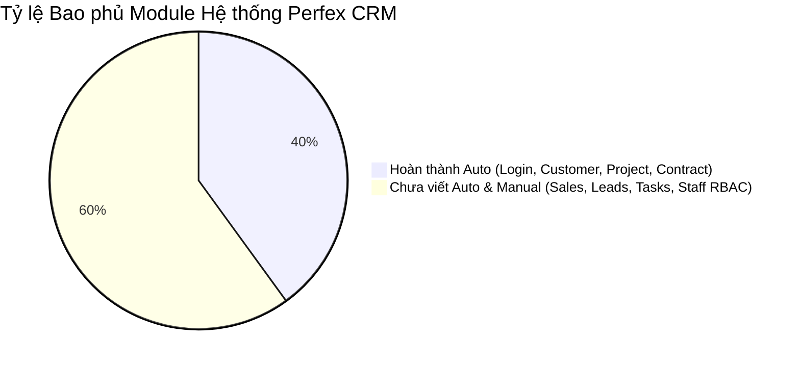
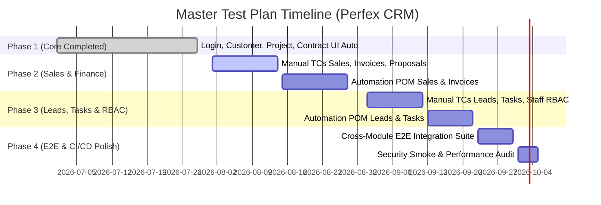

# 📋 MASTER TEST PLAN (MANUAL & AUTOMATION) — PERFEX CRM

> **Tác giả:** Senior Test Architect / QA Lead (10+ năm kinh nghiệm)  
> **Dự án:** Perfex CRM Web Application (`https://crm.anhtester.com`)  
> **Repository:** `selenium-java-framework`  
> **Ngày lập:** 29/07/2026  
> **Trạng thái:** DRAFT FOR REVIEW  

---

## 🎯 1. TỔNG QUAN VÀ MỤC TIÊU CHIẾN LƯỢC (OVERALL STRATEGY)

### 1.1 Bối cảnh & Mục tiêu
Perfex CRM là ứng dụng quản trị doanh nghiệp (Customer Relationship Management) phục vụ các hoạt động then chốt: Quản lý khách hàng, Dự án, Hợp đồng, Tài chính/Hóa đơn và Đội ngũ bán hàng.

Mục tiêu chiến lược của kế hoạch kiểm thử này là:
1. **Bao phủ 100% các chức năng cốt lõi (Core Business Flow)** qua cả 2 phương thức: Manual Testing (cho các luồng UI/UX phức tạp, exploratory) và Automation Testing (cho Regression Suite trên CI/CD).
2. **Đảm bảo tính ổn định và liên tục (Zero Flakiness)** cho hệ thống build CI/CD với tần suất chạy kiểm thử hàng ngày.
3. **Quản lý rủi ro dựa trên Risk-Based Testing (RBT)**: Tập trung nguồn lực kiểm thử vào các module có tác động tài chính và dữ liệu cao (Invoices, Customers, Contracts, RBAC).

### 1.2 Tech Stack & Phạm vi Công nghệ
- **Automation Engine:** Java 17 + Selenium WebDriver 4.27.0 + WebDriverManager 5.9.2
- **Test Runner:** TestNG 7.10.2 (Hỗ trợ DataProvider, TestNG Groups, Suite XMLs)
- **Design Pattern:** Page Object Model (POM) + ThreadLocal Driver Factory
- **Reporting & Logging:** Allure Report 2.27.0 + Log4j 2 + Automatic Screenshot Capture on Failure
- **CI/CD Pipeline:** GitHub Actions (`selenium.yml` running Headless Chrome on Ubuntu)
- **Test Data Management:** JavaFaker + Jackson Databind (JSON) + Dynamic Timestamp/Prefix Generator

---

## 🔍 2. ĐÁNH GIÁ HIỆN TRẠNG (COMPLETED VS. PENDING Gaps)

### 2.1 Hạng mục ĐÃ HOÀN THÀNH (Completed Milestones)

| Hạng mục | Module / Thành phần | Chi tiết đạt được | Đánh giá chất lượng |
| :--- | :--- | :--- | :---: |
| **Framework Architecture** | Core Engine | Thiết lập hoàn chỉnh ThreadLocal WebDriver (hỗ trợ Chrome, Firefox, Edge), Smart Waits (`WaitHelper`), BasePage/BaseTest | 🟢 **10/10** |
| **Test Data Management** | Data Utilities | `TestDataGenerator` sinh data ngẫu nhiên kèm timestamp/prefix. Tách biệt `test-data/users.json` và `customers.json`. Zero hardcode credentials | 🟢 **10/10** |
| **CI/CD Integration** | GitHub Actions | Pipeline `selenium.yml` chạy tự động khi Push/PR, export Allure HTML & Screenshot artifact khi fail | 🟢 **10/10** |
| **Automation Suite** | **1. Login & Auth** | Implement 20/21 TCs (TC_015 2FA skip cho Manual). Bao phủ Happy Path, Validation, Remember Me, Forgot Password, Security SQLi/XSS basic | 🟢 **9.5/10** |
| **Automation Suite** | **2. Customers** | Implement 26/26 TCs với Data-Driven Testing (DDT). Bao phủ tạo mới, sửa, xóa, filter, import/export CSV, validation trùng lặp | 🟢 **10/10** |
| **Automation Suite** | **3. Projects** | Implement 10 TCs. Bao phủ hiển thị DataTable, Search, Create Happy Path, Required Fields Validation, Dynamic Billing Types | 🟢 **8.5/10** |
| **Automation Suite** | **4. Contracts** | Implement 10 TCs. Bao phủ DataTable View, Search, Create Happy Path, Required Fields, Date Logic (`End < Start`), Contract Value Validation | 🟢 **8.5/10** |
| **Automation Suite** | **5. Dashboard** | Implement 5 TCs Auto + 63 TCs Manual RBT (`testcases_dashboard.csv`). Bao phủ Quick Stats, Finance Overview, User Widget, Calendar, Header Search, Security | 🟢 **9.5/10** |
| **Documentation** | Requirements & TestCases | Lưu trữ chuẩn hóa trong `docs/requirements/` (Login, Customer, Project, Contract, Task, Dashboard) và `docs/testcases/` (Markdown & CSV) | 🟢 **10/10** |

> [!NOTE]
> **Tổng số Test Cases Automation đã triển khai:** **66 Test Cases** hoạt động ổn định trên giao diện UI và trên pipeline CI/CD.

---

### 2.2 Hạng mục CHƯA HOÀN THÀNH (Pending / Functional Gaps)

> [!WARNING]
> **Các khoảng trống (Gaps) lớn cần bổ sung:**

1. **Các Module CRM Cốt lõi chưa được Kiểm thử (Chưa có Manual & Automation):**
   - 🔴 **Sales / Invoices & Payments**: Chưa có Test Cases và Automation cho tạo Hóa đơn, Thanh toán, Chiết khấu, Thuế. (Rủi ro TÀI CHÍNH cao nhất).
   - 🔴 **Proposals & Estimates**: Chưa có Test Cases chuyển đổi Báo giá -> Hợp đồng -> Hóa đơn.
   - 🔴 **Leads Management**: Chưa có Test Cases quản lý Lead Pipeline, Import Lead, Chuyển đổi Lead -> Customer.
   - 🔴 **Tasks Management & Kanban Board**: Chưa có Test Cases tạo công việc, giao việc, kéo thả Kanban.
   - 🔴 **Staff & RBAC (Role-Based Access Control)**: Chưa có bộ test kiểm tra phân quyền tài khoản (Admin vs Sales Staff vs Project Manager).
   - 🔴 **Support Desk / Tickets**: Chưa có Test Cases tiếp nhận và xử lý yêu cầu hỗ trợ.

2. **Kịch bản Kiểm thử Tích hợp Cross-Module E2E (Cross-Module Integration Flow):**
   - Hiện tại các test case chạy độc lập theo từng màn hình. Chưa có luồng E2E dài:  
     `Lead (Tạo mới) ➔ Chuyển đổi sang Customer ➔ Tạo Proposal/Estimate ➔ Ký Contract ➔ Tạo Project & Tasks ➔ Xuất Invoice ➔ Thanh toán (Payment)`.

3. **Kiểm thử Giao diện Nâng cao & Phi Chức năng (Non-Functional Testing):**
   - 🟡 **Visual Regression Testing**: Chưa phát hiện được lệch vị trí CSS/giao diện khi nâng cấp UI.
   - 🟡 **Responsive UI / Cross-Browser Matrix**: Chưa có matrix test trên các độ phân giải màn hình khác nhau (Laptop 1366x768, Desktop 1920x1080).

---

## 📅 3. LỘ TRÌNH TIMELINE THỰC HIỆN (MASTER TIMELINE)

Lộ trình triển khai tổng thể chia làm **4 Phase** kéo dài trong **9 tuần**:

### Chi tiết các Milestones & Deliverables:

| Phase | Thời gian | Mục tiêu chính | Đầu ra (Deliverables) | Resource |
| :--- | :---: | :--- | :--- | :---: |
| **Phase 1** | *Đã xong* | Khởi tạo Framework, 4 Module chính (Login, Customer, Project, Contract) | 66 Automated TCs, CI/CD Pipeline, Dynamic Data Generator | 1 Automation QA |
| **Phase 2** | Week 1–4 | Phân tích yêu cầu & Viết Test Cases cho Module **Sales (Invoices, Estimates, Proposals, Payments)** | - File `requirements_sales.md`, `testcases_sales.md` - Package `com.anhtester.pages.sales` - 30 Automated TCs cho Sales & Invoices | 1 Manual QA 1 Auto QA |
| **Phase 3** | Week 5–7 | Phân tích & Phủ Test Cases cho **Leads, Tasks/Kanban, Staff RBAC** | - File `testcases_leads.md`, `testcases_rbac.md` - Page Objects cho Leads & Tasks - 25 Automated TCs bổ sung | 1 Manual QA 1 Auto QA |
| **Phase 4** | Week 8–9 | Xây dựng bộ **Cross-Module E2E Integration Suite** & Tối ưu CI/CD | - Suite `E2E_OrderToCash_Test.java` - Allure Report Dashboard tích hợp Slack/Email notification | 1 Lead QA |

---

## 📌 4. CHECKLIST THỰC THI (ACTIONABLE CHECKLIST)

### 🔴 Checklist Ngắn Hạn (Ưu tiên Cao - Thực hiện trong 1–2 tuần tới)
- [ ] **Bổ sung Manual Test Cases cho Module Sales & Invoices**: Bóc tách requirement chức năng tạo hóa đơn, tính thuế, chiết khấu và trạng thái thanh toán (Paid, Overdue, Partially Paid).
- [ ] **Xây dựng Page Object `InvoicePage.java`**: Khai báo đầy đủ locators và các hàm tương tác UI cho màn hình Hóa đơn.
- [ ] **Viết Automation Tests `InvoiceTest.java`**: Phủ tối thiểu 10 TCs Happy Path và Form Validation cho Invoices.
- [ ] **Mở rộng Test Suites trong `testng.xml`**: Thêm suite `[MODULE 5] Invoices Management Tests`.

### 🟡 Checklist Trung Hạn (Ưu tiên Vừa - Thực hiện trong tháng tiếp theo)
- [ ] **Triển khai Test Suite Phân quyền RBAC (`RBACTest.java`)**: Kiểm thử phân quyền tài khoản Admin vs Staff. Đảm bảo nhân viên không thể sửa/xóa hợp đồng/hóa đơn khi không có quyền.
- [ ] **Xây dựng Module Leads Management**: Tạo manual TCs và automation scripts cho việc nhập Lead, đổi trạng thái Lead và chuyển đổi Lead thành Customer.
- [ ] **Xây dựng Module Tasks / Kanban Board**: Viết test cases kiểm thử giao việc, cập nhật tiến độ công việc và kéo thả trên bảng Kanban.
- [ ] **Chuẩn hóa Test Data Factory**: Bổ sung data mẫu cho Invoices, Leads, Tasks vào thư mục `test-data/`.

### 🟢 Checklist Dài Hạn (Định hướng Nâng cao - 2–3 tháng)
- [ ] **Xây dựng kịch bản E2E Full Flow (`CrossModuleE2ETest.java`)**: Chạy luồng liền mạch từ khởi tạo Lead ➔ Chuyển đổi Khách hàng ➔ Tạo Báo giá ➔ Ký Hợp đồng ➔ Xuất Hóa đơn ➔ Thanh toán.
- [ ] **Tích hợp Thông báo Kết quả Test trên CI/CD**: Gửi báo cáo tóm tắt Allure Report tự động qua Slack Channel hoặc Telegram Bot sau mỗi đợt chạy nightly build.
- [ ] **Tối ưu hóa thời gian chạy Parallel Execution**: Đổi cấu hình `thread-count="2"` hoặc `"3"` trong `testng.xml` để rút ngắn thời gian chạy regression suite từ 10 phút xuống dưới 3 phút.

---

## 🛡️ 5. QUẢN LÝ RỦI RO & KHUYẾN NGHỊ (RISK MANAGEMENT)

> [!IMPORTANT]
> **Khuyến nghị từ Senior QA Lead:**

1. **Rủi ro Dữ liệu dùng chung (Shared Data Contamination):** Khi chạy song song (Parallel execution) hoặc trên CI/CD, nếu dùng chung Customer Name hoặc Invoice Code sẽ gây ra lỗi gãy test.  
   👉 **Giải pháp:** Tiếp tục tuân thủ tuyệt đối quy tắc sinh dữ liệu động `TestDataGenerator` (mọi record khởi tạo phải chứa `timestamp` duy nhất).

2. **Rủi ro Thay đổi Giao diện (DOM Change / Dynamic Classes):** Perfex CRM sử dụng một số thư viện Bootstrap / Select2 sinh ID động.  
   👉 **Giải pháp:** Luôn sử dụng chiến lược Locator thông minh theo semantic HTML (`name`, `data-id`, `placeholder`, `aria-label`) thay vì dùng XPath tuyệt đối hoặc Tailwind/Dynamic CSS class.

3. **Bảo mật Credentials trên CI/CD:**  
   👉 **Giải pháp:** Tuyệt đối không commit file chứa mật khẩu thật lên Git. Sử dụng GitHub Secrets (`secrets.BASE_URL`, `secrets.ADMIN_EMAIL`, `secrets.ADMIN_PASSWORD`) đúng như đã cấu hình trong [selenium.yml](file:///Users/rachelnguyen/Downloads/Antigravity/antigrativy_Binhtester_kit/selenium-java-framework/.github/workflows/selenium.yml).

---
*Báo cáo Master Test Plan này được lưu trực tiếp tại thư mục dự án `selenium-java-framework/MASTER_TEST_PLAN.md`.*
